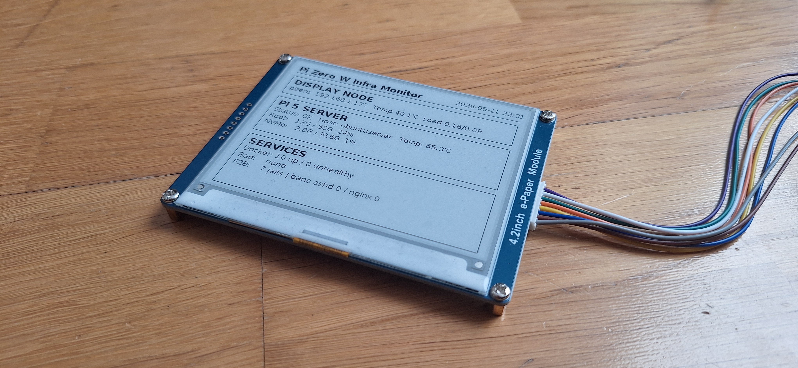
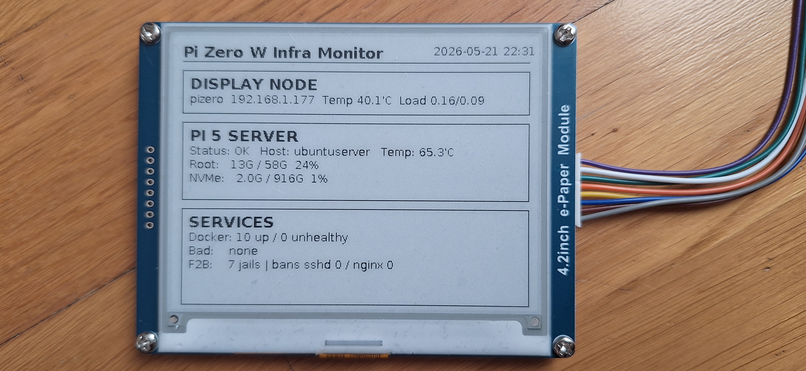
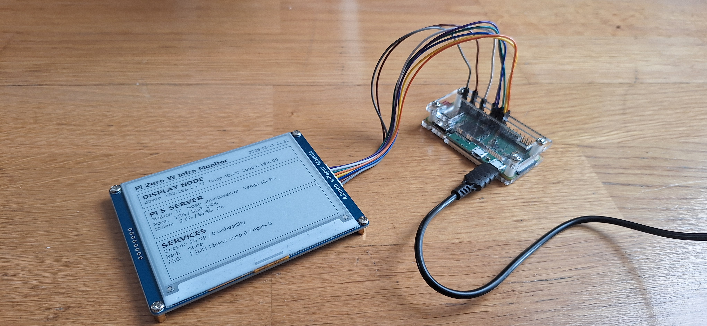
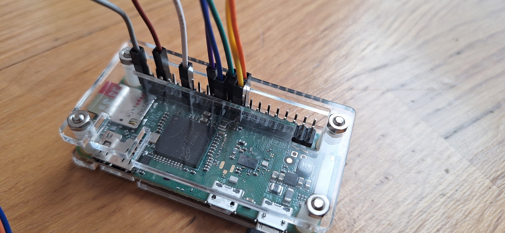

# Raspberry Pi Zero W e-Paper Infrastructure Monitor



Low-power infrastructure monitoring appliance built with:
-Raspberry Pi Zero W
-Waveshare 4.2" e-paper display
-Python
-SSH-based remote telemetry
-Docker monitoring
-Fail2ban monitoring
The device acts as a lightweight always-on display node for self-hosted infrastructure.

## Features
-Remote telemetry over SSH
-Docker container monitoring
-Docker unhealthy container detection
-Fail2ban monitoring
-Offline detection
-NVMe usage monitoring
-Automatic boot via systemd
-Low-power e-paper display
-Fully headless operation
-Single SSH query optimization for lightweight telemetry collection

## Screenshots

### Dashboard close-up



### Full setup



### GPIO wiring



## Hardware

### Main Display Node
-Raspberry Pi Zero W
-Waveshare 4.2" e-paper display (Rev 2.1)
-microSD card
-40-pin GPIO connection

### Remote Infrastructure Node
Example monitored server:
-Raspberry Pi 5
-Docker services
-Fail2ban
-NVMe storage

## Documentation

- [Wiring](docs/wiring.md)
- [Troubleshooting](docs/troubleshooting.md)
- [Architecture](docs/architecture.md)
- [Deployment](docs/deployment.md)
- [Lessons Learned](docs/lessons-learned.md)

## Architecture

```text
Raspberry Pi Zero W
        |
        | SSH telemetry
        v
Remote infrastructure server
Raspberry Pi 5
        |
        +-- Docker
        +-- Fail2ban
        +-- NVMe storage
        +-- System telemetry
```

The Pi Zero W only renders the dashboard and performs lightweight telemetry collection.
Heavy workloads remain on the monitored server.

## Project Goals

This project was designed to create a lightweight always-on infrastructure monitor with:

- extremely low power usage
- minimal software complexity
- always-visible telemetry
- reliable autonomous operation
- SSH-based remote monitoring
- no browser or web dashboard dependencies

The Raspberry Pi Zero W acts purely as a low-power telemetry appliance.

## Why e-Paper?

E-paper displays are ideal for infrastructure monitoring because:

- the image remains visible without constant refresh
- power usage is extremely low
- there is no backlight
- the display is readable from far away
- refreshes are infrequent in telemetry applications

This makes e-paper suitable for 24/7 monitoring appliances.

## Current Dashboard Data

### Display Node
-Hostname
-IP address
-CPU temperature
-Load average

### Remote Server
-Online/offline status
-CPU temperature
-Root filesystem usage
-NVMe usage
-Docker container count
-Unhealthy container detection
-Fail2ban jail count
-Fail2ban ban counters

## Example Dashboard Layout

```text
+------------------------------------------------+
| Pi Zero W Infra Monitor         2026-05-14     |
+------------------------------------------------+
| DISPLAY NODE                                   |
| pizero 192.168.x.x Temp 40C Load 0.15          |
+------------------------------------------------+
| PI 5 SERVER                                    |
| Status: OK                                     |
| Temp: 60C                                      |
| Root: 13G / 58G                                |
| NVMe: 2G / 916G                                |
+------------------------------------------------+
| SERVICES                                       |
| Docker: 10 up / 0 unhealthy                    |
| F2B: 7 jails                                   |
| Bans: sshd 0 / nginx 0                         |
+------------------------------------------------+
```

## Real-World Problems Encountered

This project involved several real-world Raspberry Pi Zero W issues.
These are intentionally documented because they are useful for others building similar systems.

### Wi-Fi Problems
Observed issues:
-rfkill soft blocks
-unstable DNS resolution
-Pi-hole related DNS issues
-Wi-Fi power saving instability
-SSH connection drops during package installation

Fixes included:
-disabling Wi-Fi power saving
-manual DNS configuration
-using Raspberry Pi OS Bullseye 32-bit
-avoiding heavier package operations when unnecessary

### Waveshare Driver Problems
The first selected Waveshare V2 driver locked permanently at:

DEBUG:waveshare_epd.epd4in2_V2:e-Paper busy

The issue was resolved by switching to the older compatible driver version.
This was especially important because:
-the display hardware revision was older
-newer Waveshare drivers were not fully compatible

## SSH Timing During Boot
After reboot:
-the Pi Zero dashboard service started faster than the remote server SSH service
-the first telemetry query failed temporarily
The dashboard was designed to recover automatically during the next refresh cycle.

### Lessons Learned
-Raspberry Pi Zero W is fully capable as a lightweight telemetry appliance
-e-paper displays are excellent for always-on infrastructure monitoring
-single-query SSH telemetry is much more stable than multiple SSH calls
-real-world networking issues matter more than raw CPU performance
-lightweight architectures are critical on low-power ARM devices

### Future Improvements
Planned improvements:
-partial refresh support
-better fonts and icons
-graph rendering
-multiple remote hosts
-historical statistics
-VPN monitoring
-last successful update timestamp
-last unhealthy container names

## Status

Project status: actively developed

Current features:

- remote SSH telemetry
- Docker monitoring
- Fail2ban monitoring
- offline detection
- NVMe monitoring
- automatic systemd startup
- Waveshare 4.2" e-paper rendering

### License
MIT License
